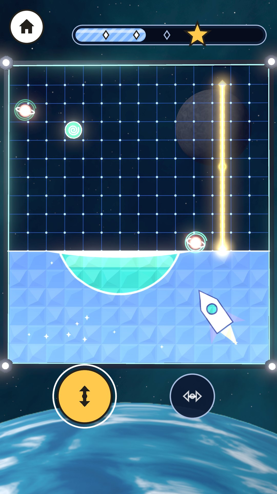
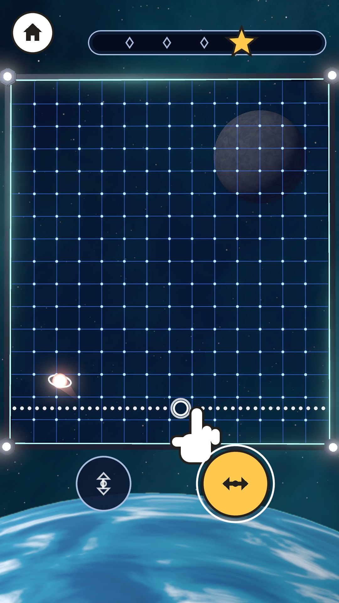
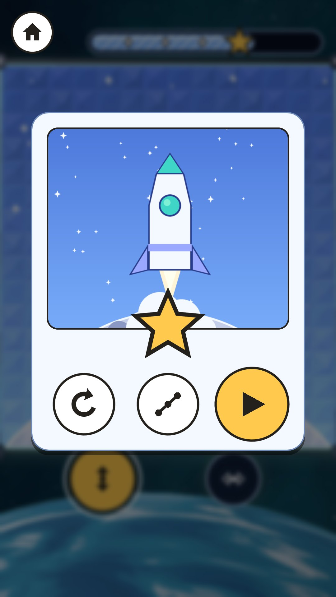
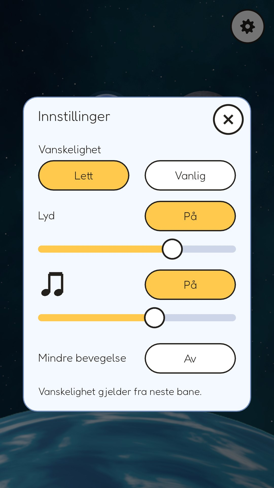

# MWM Orb Fence

**[⬇ Download the APK (Android)](https://github.com/Matswm86/mwm-orb-fence/releases/download/latest/mwm-orb-fence.apk)**

A deep-space wall-building game for Android, made for children (ages 4-7 on "Lett", 8+ on "Vanlig"). Draw glowing walls across a force-field grid to fence in the bouncing orbs; every room you close hardens into crystal and shows a piece of a hidden space picture. An orb that bumps a growing wall only pops that half like a soap bubble, so a small child never loses. No ads, no tracking, works offline, no Android permissions.

This is the **vertical slice**: world 1 "Månebanen" with 5 levels, walls, stones, the Snegl token, the win card, the level map, the Lett/Vanlig setting and the settings panel. Design: `docs/GDD.md` (rules and numbers) and `docs/DESIGN.md` (look).

| Level 1 start | Level 3 mid-capture | Win card | Settings |
|---|---|---|---|
|  |  |  |  |

## Install on a phone or tablet

1. On the device, tap [mwm-orb-fence.apk](https://github.com/Matswm86/mwm-orb-fence/releases/download/latest/mwm-orb-fence.apk) (or open the [latest release](https://github.com/Matswm86/mwm-orb-fence/releases/tag/latest)).
2. Open the file and allow "Install from this source" if Android asks.
3. If an older build will not update (signature mismatch), uninstall it first.

The APK runs on 64-bit phones and 32-bit tablets (arm64-v8a and armeabi-v7a). It is debug-signed, for sideloading only.

## How to play

- Pick a direction with the two big buttons under the field: up-down or side-side.
- Press in the field: a dotted line shows where the wall will go. Slide to move it, let go to build it. Slide off the field and let go to cancel.
- The wall grows to both edges. A room with no orb in it turns into crystal and shows part of the picture.
- If an orb touches a growing wall, only that half pops. On Lett it costs nothing. On Vanlig a pop costs a spark on levels with a spark budget (world 1 has none).
- Catch the spiral token inside a closed room to slow the orbs for a while.
- Fill the meter to the star to clear the level.
- Three-finger tap shows the performance readout (fps, draw calls, memory).

Settings (gear on the map, tap twice): Lett/Vanlig, sound on/off and volume, music on/off and volume, "Mindre bevegelse" (less motion).

## For a host app (MWM Play)

The autoload `OrbFence` holds the hooks: `set_full_unlock(on)` (default `true`, so the stand-alone build has every level open), `set_difficulty(easy)`, `set_shell_inset(inset)`, `set_sfx_on`, `set_music_on`, `set_haptics_on`, `set_less_motion`, `save_game()`, and the signals `level_card_shown(level_id)` and `free_levels_finished()`. With `Engine.set_meta(&"mwm_play_shell", true)` the game hides its own home disc and settings gear and leaves the back button to the host. Save file: `user://orb_fence_save.json`.

## Sound

Effects are synthesized by `tools/render_sfx.py` (soft plucks, glassy bells, airy sweeps, sub thumps; F# major pentatonic) with a few Kenney CC0 samples. The music is a long synthwave mix supplied by the game owner and kept low: at the default sliders the loudest effects peak near -12 dBFS and the music, in its loudest 20 s, peaks 6.4 dB under them (15.4 dB under in 400 ms loudness). `tools/audio_preview.py` reads the levels from the game code, renders `docs/audio_preview.ogg` (all effects over 20 s of music) and prints these numbers.

## Development

- Godot 4.6, `mobile` renderer, portrait 1080x1920 (stretch aspect expand). APKs are built by GitHub Actions on every push to `main`.
- Logic test (bot clears levels 1-5 in Lett and Vanlig, half pop, origin pop, spark budget and gentle restart, Snegl, ghost line, flash limiter, save): `godot --headless --audio-driver Dummy res://tests/logic_test.tscn`
- Screenshot bot: `tests/capture.tscn` (phases `shots`, `inset`, `tall`, `shell`; see the header of `tests/capture.gd`).
- Lint: `gdlint scripts tests` and `gdformat --check scripts tests`.
- Art tools: `tools/make_pictures.py` (hidden pictures for levels 1, 2, 4, 5), `tools/make_icon.py`; the mockups and 3D assets come from `docs/mockups/src/`.

Credits and licences: `CREDITS.md`. Font: Fredoka (SIL OFL 1.1, `assets/fonts/Fredoka-OFL.txt`).
